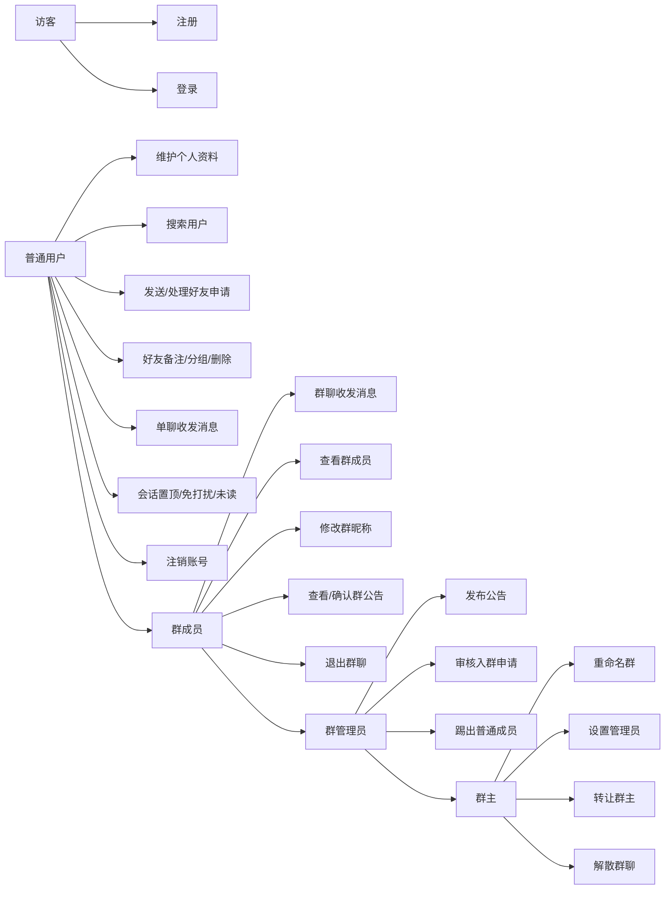
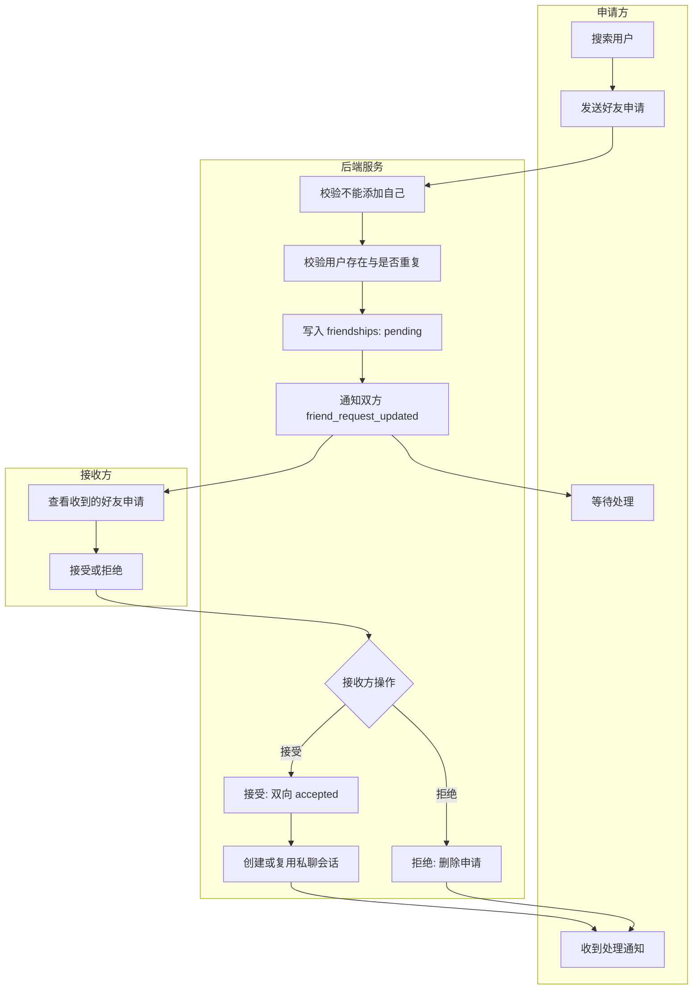
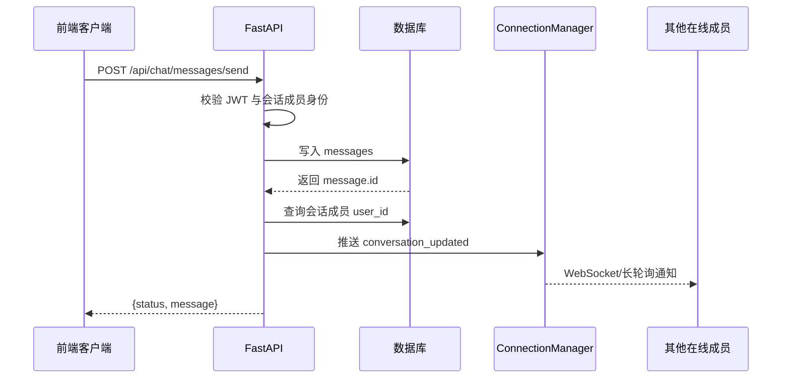
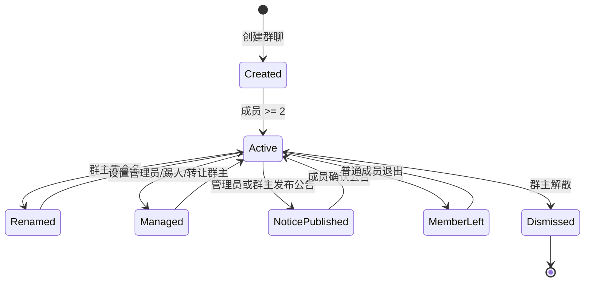
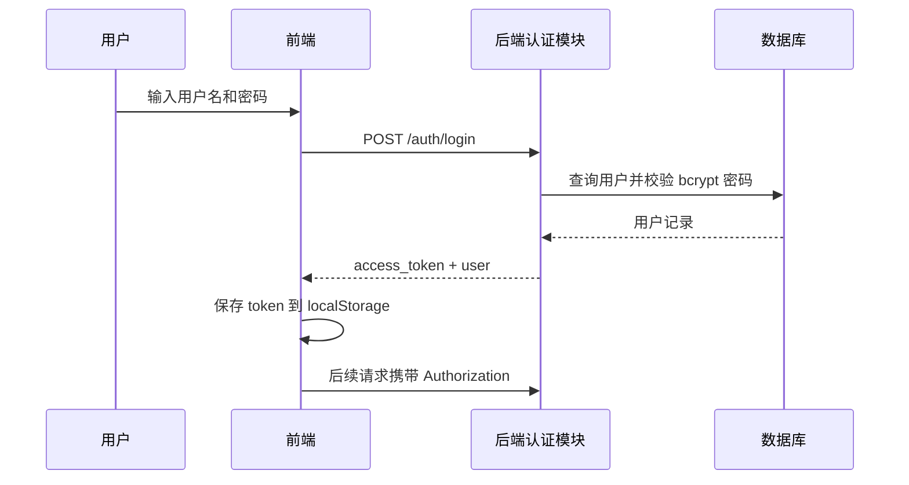
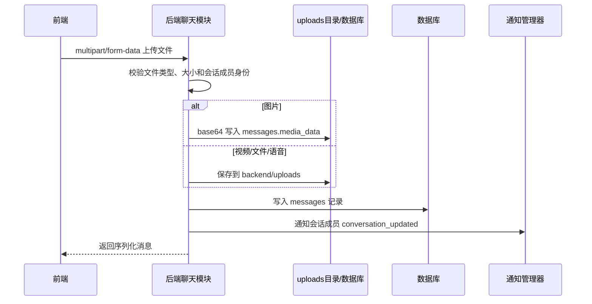
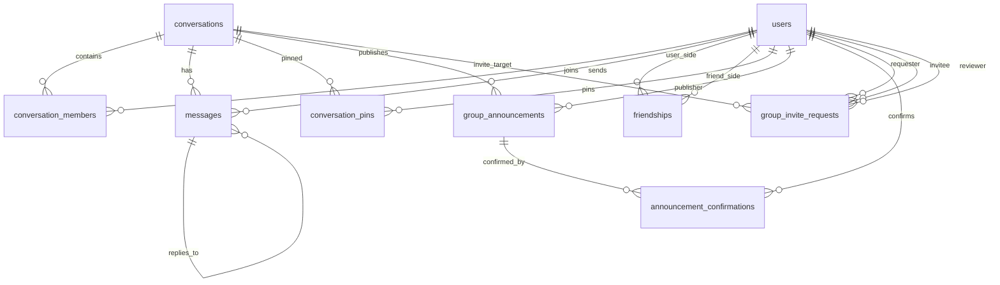

# WhatTheDogDoing 即时通讯系统开发文档

## 1. 项目概述

WhatTheDogDoing 是一个前后端分离的即时通讯系统，面向普通用户提供注册登录、好友管理、单聊、群聊、消息收发、多媒体消息、群公告、群成员管理和实时通知等能力。

项目采用 React + Vite 构建前端页面，FastAPI 提供后端 REST API 与 WebSocket/长轮询通知能力，SQLAlchemy 负责数据库访问。默认数据库为 SQLite，也支持通过 `DATABASE_URL` 切换到 MySQL。

## 2. 需求分析

### 2.1 角色

| 角色 | 说明 |
| --- | --- |
| 访客 | 未登录用户，可注册、登录。 |
| 普通用户 | 已登录用户，可管理个人资料、好友、会话、消息。 |
| 群成员 | 群聊参与者，可收发群消息、查看公告、确认公告、修改群昵称、退出群。 |
| 群管理员 | 群成员的扩展角色，可审核入群邀请、发布公告、邀请成员、踢出普通成员。 |
| 群主 | 群权限最高者，可重命名群、解散群、转让群主、设置管理员。 |

### 2.2 用户故事

| 编号 | 用户故事 | 验收要点 |
| --- | --- | --- |
| US-01 | 作为访客，我希望注册账号，以便使用即时通讯功能。 | 用户名唯一；邮箱格式正确且唯一；密码加密存储。 |
| US-02 | 作为用户，我希望登录系统，以便进入个人会话列表。 | 登录成功返回 JWT；后续请求携带 `Authorization: Bearer <token>`。 |
| US-03 | 作为用户，我希望维护个人资料，以便展示昵称、头像、简介等信息。 | 可更新昵称、性别、电话、简介、邮箱、头像；敏感信息需密码验证。 |
| US-04 | 作为用户，我希望搜索其他用户并发送好友申请，以便建立联系人关系。 | 不能添加自己；不能重复申请；双方接受后建立双向好友关系。 |
| US-05 | 作为用户，我希望查看并处理好友申请，以便同意或拒绝陌生人的请求。 | 可查看收到和发出的申请；接受后自动创建私聊会话。 |
| US-06 | 作为用户，我希望给好友设置备注和分组，以便管理联系人。 | 备注和分组只影响当前用户视角。 |
| US-07 | 作为用户，我希望与好友进行单聊，以便收发文本、图片、视频、文件、语音消息。 | 消息写入数据库；会话列表更新；支持回复消息和撤回本人消息。 |
| US-08 | 作为用户，我希望创建群聊并邀请好友，以便多人沟通。 | 群聊至少包含两名成员；只能邀请好友；创建者为群主。 |
| US-09 | 作为群成员，我希望查看群成员列表并修改群昵称，以便识别群内身份。 | 成员列表按群主、管理员、普通成员排序；群昵称只在当前群生效。 |
| US-10 | 作为群管理员/群主，我希望管理群成员和公告，以便维护群秩序。 | 可发布公告、审核邀请、踢人；群主可设置管理员、转让群主、解散群。 |
| US-11 | 作为用户，我希望收到实时通知，以便及时看到会话、好友申请、入群申请更新。 | WebSocket 在线推送；HTTP 长轮询作为降级方案。 |
| US-12 | 作为用户，我希望删除账号，以便清除个人数据。 | 删除用户、好友关系、私聊会话、个人消息和相关会话成员记录。 |

### 2.3 用例图



### 2.4 好友申请泳道图



### 2.5 消息发送序列图



### 2.6 群聊管理工作流



## 3. 系统架构与模块说明

### 3.1 技术栈

| 层级 | 技术 | 说明 |
| --- | --- | --- |
| 前端 | React、Vite、Axios | 单页应用、组件化 UI、统一 API 封装。 |
| 后端 | FastAPI、Pydantic、SQLAlchemy | REST API、WebSocket、请求校验、ORM。 |
| 数据库 | SQLite/MySQL | 默认 SQLite；生产可使用 MySQL。 |
| 部署 | Docker、Nginx | 前后端和数据库均提供 Dockerfile 或配置。 |

### 3.2 前端模块

| 模块 | 文件/目录 | 用途 |
| --- | --- | --- |
| 应用入口 | `frontend/src/main.jsx`、`frontend/src/App.jsx` | 渲染主应用，组织登录、注册、聊天主界面。 |
| API 服务 | `frontend/src/services/api.js` | 封装所有后端 HTTP 请求、Token 保存、错误处理。 |
| Stage2 组件 | `frontend/src/components/stage2/` | 顶栏、侧边栏、聊天主视图、弹层、认证视图、法律弹窗等。 |
| 好友组件 | `frontend/src/features/friend/` | 好友列表项与样式。 |
| 样式系统 | `frontend/src/styles/app/`、`frontend/src/App.css` | 页面布局、聊天面板、弹窗、认证页、好友栏等样式。 |
| 页面样式 | `frontend/src/pages/` | 登录页、注册页局部样式。 |
| 静态资源 | `frontend/src/assets/`、`frontend/public/` | 图标、图片、favicon。 |

### 3.3 后端模块

| 模块 | 文件 | 用途 |
| --- | --- | --- |
| 应用入口 | `backend/app/main.py` | 创建 FastAPI 应用、CORS、静态上传目录、数据库初始化、路由注册、账号删除接口。 |
| 认证模块 | `backend/app/auth.py` | 注册、登录、JWT 解析、当前用户依赖、密码修改、个人资料维护。 |
| 聊天模块 | `backend/app/chat.py` | 好友、会话、消息、群聊、公告、入群申请、WebSocket 与长轮询通知。 |
| 数据库连接 | `backend/app/database.py` | 数据库 URL 归一化、SQLAlchemy engine/session、`get_db` 依赖。 |
| 数据模型 | `backend/app/models.py` | 定义用户、会话、成员、消息、好友、群公告等 ORM 表结构。 |
| 测试 | `backend/tests/` | 覆盖认证、聊天、数据库、好友、群聊高级功能等。 |

### 3.4 后端初始化和数据迁移

后端启动时执行 `initialize_database()`：

1. 连接数据库，最多重试 20 次。
2. 调用 `models.Base.metadata.create_all()` 创建表。
3. 对旧数据库执行兼容性迁移，例如补充 `users.status`、`messages.media_data`、`conversation_members.role` 等字段。
4. MySQL 下将头像和图片数据字段扩展为 `MEDIUMTEXT`。

## 4. API 文档

### 4.1 通用约定

除注册、登录、健康检查和根路径外，大部分接口需要认证：

```http
Authorization: Bearer <access_token>
```

普通 JSON 请求使用：

```http
Content-Type: application/json
```

登录接口使用表单：

```http
Content-Type: application/x-www-form-urlencoded
```

文件上传接口使用 `multipart/form-data`。

统一错误格式遵循 FastAPI：

```json
{
  "detail": "错误原因"
}
```

### 4.2 基础接口

| 方法 | 路径 | 认证 | 说明 |
| --- | --- | --- | --- |
| GET | `/` | 否 | 服务根路径，返回项目问候信息。 |
| GET | `/health` | 否 | 健康检查，返回 `{"status":"ok"}`。 |
| DELETE | `/api/users/me` | 是 | 删除当前账号及相关数据。 |
| GET | `/uploads/{filename}` | 否 | 访问上传的视频、文件、语音等静态资源。 |

### 4.3 认证与用户资料接口

| 方法 | 路径 | 请求体/参数 | 响应 | 说明 |
| --- | --- | --- | --- | --- |
| POST | `/auth/register` | `{username,password,email?}` | `{id,username,email,status}` | 注册用户。 |
| POST | `/auth/login` | 表单 `username,password` | `{access_token,token_type,user}` | 登录并返回 JWT。 |
| GET | `/auth/me` | 无 | `{id,username,email,status}` | 获取当前登录用户。 |
| POST | `/auth/logout` | 无 | `{message}` | 登出，前端会清除本地 Token。 |
| PUT | `/auth/change-password` | `{old_password,new_password}` | `{message}` | 修改密码。 |
| GET | `/auth/profile` | 无 | 用户资料对象 | 获取当前用户资料。 |
| PUT | `/auth/profile` | `{nickname?,gender?,phone?,bio?,email?,avatar?}` | 用户资料对象 | 更新基础资料。 |
| POST | `/auth/profile/sensitive` | `{password,new_email?,new_phone?,new_password?}` | `{message,updated_fields}` | 验证当前密码后修改敏感信息。 |

示例：登录请求

```http
POST /auth/login
Content-Type: application/x-www-form-urlencoded

username=alice&password=123456
```

示例：登录响应

```json
{
  "access_token": "jwt-token",
  "token_type": "bearer",
  "user": {
    "id": 1,
    "username": "alice",
    "email": "alice@example.com",
    "status": "offline"
  }
}
```

说明：前端 `api.js` 中存在 `PUT /auth/status` 调用，但当前后端代码未实现该接口，后续维护时需要补齐或移除前端调用。

### 4.4 好友接口

| 方法 | 路径 | 请求体/参数 | 响应 | 说明 |
| --- | --- | --- | --- | --- |
| GET | `/api/chat/users/search?q=keyword` | 查询参数 `q` | 用户数组 | 搜索用户名或邮箱。 |
| GET | `/api/chat/friends` | 无 | 好友数组 | 获取当前用户好友列表。 |
| GET | `/api/chat/friends/requests` | 无 | `{incoming,outgoing}` | 获取收到和发出的好友申请。 |
| POST | `/api/chat/friends/requests` | `{friend_id}` | 申请对象 | 发送好友申请。 |
| POST | `/api/chat/friends/requests/{request_id}/accept` | 无 | `{message,friend,conversation_id}` | 接受好友申请并建立私聊。 |
| POST | `/api/chat/friends/requests/{request_id}/reject` | 无 | `{message}` | 拒绝好友申请。 |
| POST | `/api/chat/friends/add` | `{friend_id}` | `{message,friend,conversation_id}` | 直接添加好友并建立私聊。 |
| PUT | `/api/chat/friends/{friend_id}/remark` | `{remark}` | `{message,remark}` | 修改好友备注。 |
| PUT | `/api/chat/friends/{friend_id}/group` | `{group_name}` | `{message,group}` | 修改好友分组。 |
| DELETE | `/api/chat/friends/{friend_id}` | 无 | `{message}` | 删除好友及对应私聊。 |

好友对象格式：

```json
{
  "id": 2,
  "userId": "bob",
  "accountId": "2",
  "name": "Bob",
  "avatar": "/default-avatar.png",
  "signature": "",
  "email": "bob@example.com",
  "group": "我的好友",
  "remark": ""
}
```

### 4.5 会话接口

| 方法 | 路径 | 请求体/参数 | 响应 | 说明 |
| --- | --- | --- | --- | --- |
| GET | `/api/chat/sessions` | 无 | 会话数组 | 获取当前用户所有会话。 |
| POST | `/api/chat/sessions/{conversation_id}/pin` | 无 | `{message,conversation_id,isPinned}` | 置顶会话。 |
| DELETE | `/api/chat/sessions/{conversation_id}/pin` | 无 | `{message,conversation_id,isPinned}` | 取消置顶。 |
| PUT | `/api/chat/sessions/{conversation_id}/mute` | `{muted}` | `{message,conversation_id,isMuted}` | 设置免打扰。 |
| GET | `/api/chat/sessions/{conversation_id}/messages` | 无 | 消息数组 | 获取会话消息，并更新当前用户已读位置。 |

会话对象格式：

```json
{
  "id": 10,
  "title": "Bob",
  "avatar": "/default-avatar.png",
  "lastMessage": "你好",
  "time": "2026年05月26日 10:30",
  "timestamp": "2026-05-26T02:30:00",
  "badge": 1,
  "isGroup": false,
  "realName": "bob",
  "isPinned": false,
  "isMuted": false,
  "peerUserId": 2
}
```

### 4.6 消息接口

| 方法 | 路径 | 请求体/参数 | 响应 | 说明 |
| --- | --- | --- | --- | --- |
| POST | `/api/chat/messages/send` | `{conversation_id,content,reply_to_id?}` | `{status,message}` | 发送文本消息。 |
| POST | `/api/chat/messages/send-image?conversation_id=&reply_to_id?=` | `file` | `{status,message}` | 发送图片，最大 5MB，图片以 base64 持久化。 |
| POST | `/api/chat/messages/send-video?conversation_id=&reply_to_id?=` | `file` | `{status,message}` | 发送视频，最大 50MB，文件保存到 `/uploads`。 |
| POST | `/api/chat/messages/send-file?conversation_id=&reply_to_id?=` | `file` | `{status,message}` | 发送文件，最大 20MB。 |
| POST | `/api/chat/messages/send-voice?conversation_id=&reply_to_id?=` | `file` | `{status,message}` | 发送语音，最大 2MB。 |
| DELETE | `/api/chat/messages/{message_id}` | 无 | `{message,message_id}` | 撤回本人发送的消息。 |

消息对象格式：

```json
{
  "id": 100,
  "text": "你好",
  "type": "text",
  "sender": "me",
  "senderId": 1,
  "senderName": "Alice",
  "time": "2026年05月26日 10:30",
  "timestamp": "2026-05-26T02:30:00",
  "replyToId": null
}
```

图片、视频、文件、语音消息会额外返回：

```json
{
  "mediaUrl": "/uploads/file.mp4",
  "mediaName": "file.mp4"
}
```

### 4.7 群聊接口

| 方法 | 路径 | 请求体/参数 | 响应 | 说明 |
| --- | --- | --- | --- | --- |
| POST | `/api/chat/groups` | `{name,member_ids}` | `{message,conversation_id}` | 创建群聊，创建者为群主。 |
| GET | `/api/chat/groups/{conversation_id}/members` | 无 | 成员数组 | 获取群成员。 |
| PUT | `/api/chat/groups/{conversation_id}` | `{name}` | `{message,conversation_id,title}` | 群主重命名群聊。 |
| POST | `/api/chat/groups/{conversation_id}/exit` | 无 | `{message,conversation_id}` | 普通成员退出群聊；群主需先转让。 |
| DELETE | `/api/chat/groups/{conversation_id}` | 无 | `{message,conversation_id}` | 群主解散群聊。 |
| POST | `/api/chat/groups/{conversation_id}/invite` | `{member_ids}` | `{message,conversation_id,invited_count}` | 邀请好友加入群聊。 |
| POST | `/api/chat/groups/{conversation_id}/transfer` | `{new_owner_id}` | `{message}` | 群主转让。 |
| POST | `/api/chat/groups/{conversation_id}/kick` | `{user_id}` | `{message}` | 群主或管理员踢人。 |
| PUT | `/api/chat/groups/{conversation_id}/admin` | `{user_id,is_admin}` | `{message,role}` | 群主设置或取消管理员。 |
| PUT | `/api/chat/groups/{conversation_id}/nickname` | `{nickname}` | `{message,group_nickname}` | 修改本人群昵称。 |

群成员对象格式：

```json
{
  "id": 1,
  "name": "alice",
  "displayName": "Alice",
  "groupNickname": "",
  "avatar": "A",
  "role": "owner"
}
```

### 4.8 群公告接口

| 方法 | 路径 | 请求体/参数 | 响应 | 说明 |
| --- | --- | --- | --- | --- |
| GET | `/api/chat/groups/{conversation_id}/announcements` | 无 | 公告数组 | 获取群公告。 |
| POST | `/api/chat/groups/{conversation_id}/announcements` | `{content}` | `{message,announcement}` | 群主或管理员发布公告。 |
| GET | `/api/chat/groups/{conversation_id}/announcements/unconfirmed` | 无 | 公告数组 | 获取当前用户未确认公告。 |
| POST | `/api/chat/groups/{conversation_id}/announcements/{announcement_id}/confirm` | 无 | `{message}` | 确认公告。 |

公告对象格式：

```json
{
  "id": 1,
  "content": "本周五例会",
  "publisherName": "Alice",
  "createdAt": "2026年05月26日 10:30"
}
```

### 4.9 入群申请接口

| 方法 | 路径 | 请求体/参数 | 响应 | 说明 |
| --- | --- | --- | --- | --- |
| POST | `/api/chat/groups/{conversation_id}/invite-requests` | `{invitee_id}` | `{message,request}` | 成员提交邀请好友入群申请。 |
| GET | `/api/chat/groups/invite-requests` | 无 | 申请数组 | 群主或管理员查看待审核入群申请。 |
| POST | `/api/chat/groups/invite-requests/{request_id}/approve` | 无 | `{message}` | 审核通过并加入群聊。 |
| POST | `/api/chat/groups/invite-requests/{request_id}/reject` | 无 | `{message}` | 拒绝入群申请。 |

入群申请对象格式：

```json
{
  "id": 1,
  "conversationId": 10,
  "groupName": "项目群",
  "requesterId": 1,
  "requesterName": "Alice",
  "requesterAvatar": "A",
  "inviteeId": 2,
  "inviteeName": "Bob",
  "inviteeAvatar": "B",
  "status": "pending",
  "createdAt": "2026-05-26T02:30:00"
}
```

### 4.10 实时通知接口

| 方法 | 路径 | 请求体/参数 | 响应 | 说明 |
| --- | --- | --- | --- | --- |
| WebSocket | `/api/chat/ws/{user_id}` | JSON 文本 | 推送 JSON | 建立实时连接，也支持通过 WebSocket 发送文本消息。 |
| GET | `/api/chat/poll/{user_id}?timeout=25` | 查询参数 `timeout<=55` | 通知数组 | 长轮询降级方案。 |

通知类型：

| type | 触发场景 |
| --- | --- |
| `conversation_updated` | 新消息、撤回消息、群系统消息等导致会话变化。 |
| `friend_request_updated` | 好友申请创建、接受、拒绝。 |
| `group_invite_request_updated` | 入群申请创建、审核通过、拒绝。 |

WebSocket 发送文本消息格式：

```json
{
  "action": "send_message",
  "conversation_id": 10,
  "content": "你好",
  "reply_to_id": null
}
```

## 5. 前后端交互流程

### 5.1 登录和鉴权流程



### 5.2 多媒体消息流程



## 6. 数据库设计文档

### 6.1 数据库配置

默认连接：

```text
sqlite:///./whatthedogdoing.db
```

可通过环境变量 `DATABASE_URL` 覆盖。若使用 `mysql://`，系统会自动转换为 `mysql+pymysql://`。

### 6.2 表结构

#### users

| 字段 | 类型 | 约束 | 说明 |
| --- | --- | --- | --- |
| id | Integer | PK, index | 用户 ID。 |
| username | String(64) | unique, index, not null | 用户名。 |
| email | String(255) | unique, index, nullable | 邮箱。 |
| hashed_password | String(255) | not null | bcrypt 密码哈希。 |
| is_active | Boolean | default true, not null | 是否启用。 |
| created_at | DateTime | default now, not null | 创建时间。 |
| updated_at | DateTime | default now, on update | 更新时间。 |
| last_login | DateTime | nullable | 最近登录时间。 |
| status | String | default offline | 在线状态。 |
| last_status | String | default online | 退出前状态。 |
| nickname | String(64) | nullable | 昵称。 |
| gender | String(16) | nullable | 性别。 |
| phone | String(32) | nullable | 手机号。 |
| bio | String(500) | nullable | 简介。 |
| avatar | Text/MEDIUMTEXT | nullable | 头像数据或路径。 |

#### conversations

| 字段 | 类型 | 约束 | 说明 |
| --- | --- | --- | --- |
| id | Integer | PK, index | 会话 ID。 |
| is_group | Boolean | default false, not null | 是否群聊。 |
| name | String(255) | nullable | 群名称；私聊通常为空。 |
| created_at | DateTime | default now, not null | 创建时间。 |
| updated_at | DateTime | default now, on update | 更新时间。 |

#### conversation_members

| 字段 | 类型 | 约束 | 说明 |
| --- | --- | --- | --- |
| id | Integer | PK, index | 成员记录 ID。 |
| conversation_id | Integer | FK conversations.id, index, not null | 所属会话。 |
| user_id | Integer | FK users.id, index, not null | 成员用户。 |
| joined_at | DateTime | default now, not null | 加入时间。 |
| read_index | Integer | default 0, not null | 已读到的最大消息 ID。 |
| role | String(16) | default member, not null | 群角色：owner/admin/member。 |
| group_nickname | String(64) | nullable | 当前群昵称。 |
| mute_notifications | Boolean | default false, not null | 是否免打扰。 |

#### messages

| 字段 | 类型 | 约束 | 说明 |
| --- | --- | --- | --- |
| id | Integer | PK, index | 消息 ID。 |
| conversation_id | Integer | FK conversations.id, index, not null | 所属会话。 |
| sender_id | Integer | FK users.id, nullable | 发送者；系统消息为空。 |
| reply_to_id | Integer | FK messages.id, index, nullable | 回复的消息。 |
| message_type | String(20) | default text, not null | text/image/video/file/voice/system。 |
| content | String(2000) | nullable | 文本内容或占位文本。 |
| media_url | String(500) | nullable | 上传文件 URL。 |
| media_data | Text/MEDIUMTEXT | nullable | 图片 base64 数据。 |
| media_name | String(200) | nullable | 原始文件名。 |
| timestamp | DateTime | default now, not null | 发送时间。 |

#### conversation_pins

| 字段 | 类型 | 约束 | 说明 |
| --- | --- | --- | --- |
| id | Integer | PK, index | 置顶记录 ID。 |
| conversation_id | Integer | FK conversations.id, index, not null | 被置顶会话。 |
| user_id | Integer | FK users.id, index, not null | 操作用户。 |
| created_at | DateTime | default now, not null | 置顶时间。 |

#### friendships

| 字段 | 类型 | 约束 | 说明 |
| --- | --- | --- | --- |
| id | Integer | PK, index | 好友关系/申请 ID。 |
| user_id | Integer | FK users.id, not null | 发起方或当前用户。 |
| friend_id | Integer | FK users.id, not null | 好友或申请接收方。 |
| status | String(32) | default pending | pending/accepted。 |
| remark | String(64) | nullable | 当前用户给好友的备注。 |
| group_name | String(64) | nullable | 当前用户给好友设置的分组。 |
| created_at | DateTime | default now | 创建时间。 |

#### group_announcements

| 字段 | 类型 | 约束 | 说明 |
| --- | --- | --- | --- |
| id | Integer | PK, index | 公告 ID。 |
| conversation_id | Integer | FK conversations.id, index, not null | 所属群聊。 |
| publisher_id | Integer | FK users.id, index, nullable | 发布者。 |
| content | String(1000) | not null | 公告内容。 |
| created_at | DateTime | default now, not null | 发布时间。 |

#### announcement_confirmations

| 字段 | 类型 | 约束 | 说明 |
| --- | --- | --- | --- |
| id | Integer | PK, index | 确认记录 ID。 |
| announcement_id | Integer | FK group_announcements.id, index, not null | 被确认公告。 |
| user_id | Integer | FK users.id, index, not null | 确认用户。 |
| confirmed_at | DateTime | default now, not null | 确认时间。 |

#### group_invite_requests

| 字段 | 类型 | 约束 | 说明 |
| --- | --- | --- | --- |
| id | Integer | PK, index | 入群申请 ID。 |
| conversation_id | Integer | FK conversations.id, index, not null | 目标群聊。 |
| requester_id | Integer | FK users.id, index, not null | 申请/邀请发起人。 |
| invitee_id | Integer | FK users.id, index, not null | 被邀请人。 |
| reviewer_id | Integer | FK users.id, index, nullable | 审核人。 |
| status | String(32) | default pending, not null | pending/approved/rejected。 |
| created_at | DateTime | default now, not null | 申请时间。 |
| reviewed_at | DateTime | nullable | 审核时间。 |

### 6.3 表关系 ER 图



### 6.4 关系说明

| 关系 | 说明 |
| --- | --- |
| `users` 与 `conversation_members` | 一名用户可加入多个会话；一个会话包含多个成员。 |
| `conversations` 与 `messages` | 一个会话拥有多条消息；消息属于一个会话。 |
| `messages.reply_to_id` 自关联 | 一条消息可以回复另一条消息。 |
| `friendships` 双向好友 | 接受好友申请后，系统为双方各维护一条 `accepted` 记录，便于按当前用户查询好友列表和备注分组。 |
| `conversation_pins` | 用户和会话之间的置顶关系，按用户维度生效。 |
| `group_announcements` 与 `announcement_confirmations` | 群公告和用户确认记录是一对多关系。 |
| `group_invite_requests` | 记录入群申请、被邀请人、审核人和审核状态。 |

### 6.5 删除与级联策略

模型中外键定义了以下意图：

| 表 | 外键策略 |
| --- | --- |
| `conversation_members.conversation_id` | `ON DELETE CASCADE` |
| `conversation_members.user_id` | `ON DELETE CASCADE` |
| `messages.conversation_id` | `ON DELETE CASCADE` |
| `messages.sender_id` | `ON DELETE SET NULL` |
| `messages.reply_to_id` | `ON DELETE SET NULL` |
| `conversation_pins.conversation_id/user_id` | `ON DELETE CASCADE` |
| `friendships.user_id/friend_id` | `ON DELETE CASCADE` |
| `group_announcements.conversation_id` | `ON DELETE CASCADE` |
| `group_announcements.publisher_id` | `ON DELETE SET NULL` |
| `announcement_confirmations.announcement_id/user_id` | `ON DELETE CASCADE` |
| `group_invite_requests.conversation_id/requester_id/invitee_id` | `ON DELETE CASCADE` |
| `group_invite_requests.reviewer_id` | `ON DELETE SET NULL` |

同时，部分业务删除在代码中显式执行，例如删除好友时会删除双方好友关系和对应私聊会话；删除账号时会清理好友关系、私聊、置顶、消息和成员记录。

## 7. 权限与业务规则

| 场景 | 规则 |
| --- | --- |
| 认证 | 通过 JWT 的 `sub` 字段识别用户名。 |
| 好友申请 | 不能添加自己；不能重复申请；已是好友不可再次申请。 |
| 私聊创建 | 接受好友申请或直接添加好友后创建/复用两人私聊。 |
| 消息读取 | 读取会话消息后更新当前成员的 `read_index`。 |
| 消息撤回 | 只能撤回本人发送的消息。 |
| 群创建 | 创建者自动为 owner；成员至少 2 人；邀请对象必须为好友。 |
| 群重命名/解散 | 仅 owner 可执行。 |
| 群公告 | owner/admin 可发布，成员可查看和确认。 |
| 入群申请审核 | owner/admin 可审核。 |
| 踢人 | owner 可踢任何非自己成员；admin 只能踢普通成员。 |
| 设置管理员 | 仅 owner 可设置或取消 admin。 |
| 群主退出 | owner 不能直接退出，需先转让群主。 |


